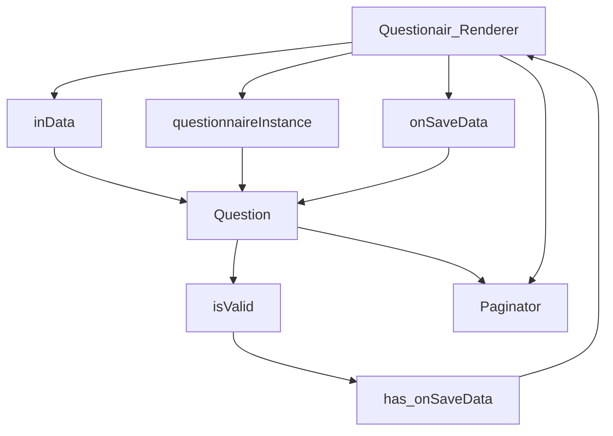

 

```mermaid
graph TD; 
    Questionair_Renderer-->inData-->Question;
    Questionair_Renderer-->questionnaireInstance-->Question;
    Questionair_Renderer-->onSaveData-->Question;  
    Question-->isValid-->has_onSaveData-->Questionair_Renderer;
    Questionair_Renderer-->Paginator;
    Question-->Paginator;
```